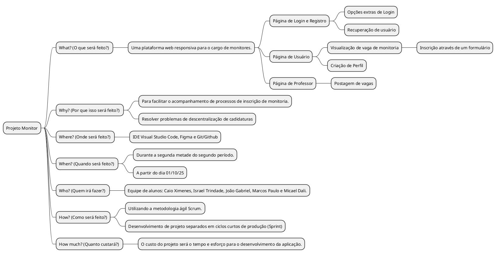

# Brainstorm e Análise 5W2H do Projeto

## 1. Visão Geral e Justificativa

O programa de monitoria do Ibmec é uma ferramenta acadêmica valiosa, porém seu processo de gestão atual é descentralizado e predominantemente manual. Isso gera ineficiência para a coordenação, falta de clareza para os candidatos e dificuldade para os alunos encontrarem os monitores de que precisam.

Este projeto se justifica pela necessidade de **modernizar, centralizar e otimizar** todo o ciclo de vida do programa de monitoria, criando uma plataforma única que servirá como ponto de encontro entre coordenação, monitores e alunos, agregando valor a toda a comunidade acadêmica.

---

## 2. Objetivos e Critérios de Sucesso

### Objetivos do Projeto
* **Simplificar o Cadastro:** Criar um fluxo de inscrição 100 online, rápido e intuitivo para alunos interessados em se tornarem monitores.
* **Centralizar Informações:** Oferecer um painel onde alunos possam encontrar facilmente os monitores disponíveis para cada matéria disponíveis.
* **Otimizar a Gestão:** Fornecer uma área administrativa para a coordenação aprovar monitores, gerenciar o programa e extrair relatórios de forma eficiente.

### Critérios de Sucesso (Como saberemos que vencemos?)
* Redução do tempo gasto pela coordenação com tarefas manuais de gestão.
* Feedback positivo de alunos e candidatos sobre a facilidade de uso da plataforma.
* Adoção da plataforma como o único meio oficial para inscrição e consulta de monitores.

---

## 3. Análise Resumida (5W2H)

O diagrama a seguir resume os pontos fundamentais do projeto no formato 5W2H.

---

## 4. Escopo de Alto Nível

#### O que está incluído no escopo deste projeto:
* Módulo de autenticação de usuários (alunos, professores e coordenação).
* Módulo completo de candidatura para monitores, incluindo upload de documentos.
* Painel administrativo para gestão de candidaturas, monitores e vagas.
* Geração de relatórios básicos (ex: lista de monitores por curso).

#### O que está fora do escopo deste projeto:
* Aplicativo móvel nativo (o foco é em uma plataforma web responsiva).
* Integração direta com o sistema de notas da faculdade (as informações de CR serão inseridas ou anexadas pelo aluno).
* Módulo de agendamento de sessões ou chat em tempo real entre alunos e monitores.
* Módulo financeiro para gestão de bolsas-auxílio.

---

## 5. Principais Envolvidos (Stakeholders)

| Nome | Papel no Projeto |
| :--- | :--- |
| **Prof. Thiago Souza** | Coordenador Geral dos Projetos de Extensão |
| **Prof. Jonh Carvalho** | Orientador Técnico (Front-End e Back-End) |
| **Leci Lima** | Stakeholder Principal / Cliente (Coordenadora da Casa) |
| **Rebeca Alves** | Stakeholder Principal / Cliente (Suporte ao Aluno) |
| **Equipe de Dev** | Responsáveis pela concepção e desenvolvimento |
| **Alunos e Monitores**| Usuários Finais da Plataforma |
