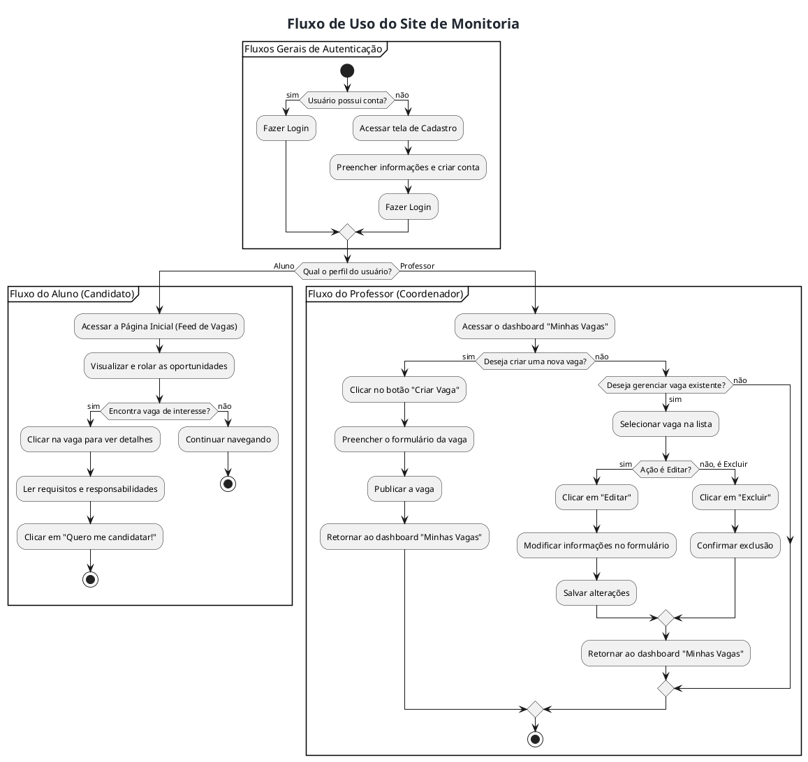

# HTA – Análise Hierárquica de tarefas

```puml
@startuml
title Fluxo de Uso do Site de Monitoria

skinparam title {
  FontSize 20
  FontColor #222831
}

' 1. FLUXO DE AUTENTICAÇÃO (INÍCIO)
partition "Fluxos Gerais de Autenticação" {
    start
    if (Usuário possui conta?) then (sim)
        :Fazer Login;
    else (não)
        :Acessar tela de Cadastro;
        :Preencher informações e criar conta;
        :Fazer Login;
    endif
}

' 2. DECISÃO CENTRAL APÓS AUTENTICAÇÃO
if (Qual o perfil do usuário?) then (Aluno)
    ' 3. FLUXO DO ALUNO
    partition "Fluxo do Aluno (Candidato)" {
        :Acessar a Página Inicial (Feed de Vagas);
        :Visualizar e rolar as oportunidades;
        if (Encontra vaga de interesse?) then (sim)
            :Clicar na vaga para ver detalhes;
            :Ler requisitos e responsabilidades;
            :Clicar em "Quero me candidatar!";
            stop
        else (não)
            :Continuar navegando;
            stop
        endif
    }
else (Professor)
    ' 4. FLUXO DO PROFESSOR
    partition "Fluxo do Professor (Coordenador)" {
        :Acessar o dashboard "Minhas Vagas";
        if (Deseja criar uma nova vaga?) then (sim)
            :Clicar no botão "Criar Vaga";
            :Preencher o formulário da vaga;
            :Publicar a vaga;
            :Retornar ao dashboard "Minhas Vagas";
        else (não)
            if (Deseja gerenciar vaga existente?) then (sim)
                :Selecionar vaga na lista;
                if (Ação é Editar?) then (sim)
                    :Clicar em "Editar";
                    :Modificar informações no formulário;
                    :Salvar alterações;
                else (não, é Excluir)
                    :Clicar em "Excluir";
                    :Confirmar exclusão;
                endif
                :Retornar ao dashboard "Minhas Vagas";
            else (não)
                endif
        endif
        stop
    }
endif

@enduml
```
