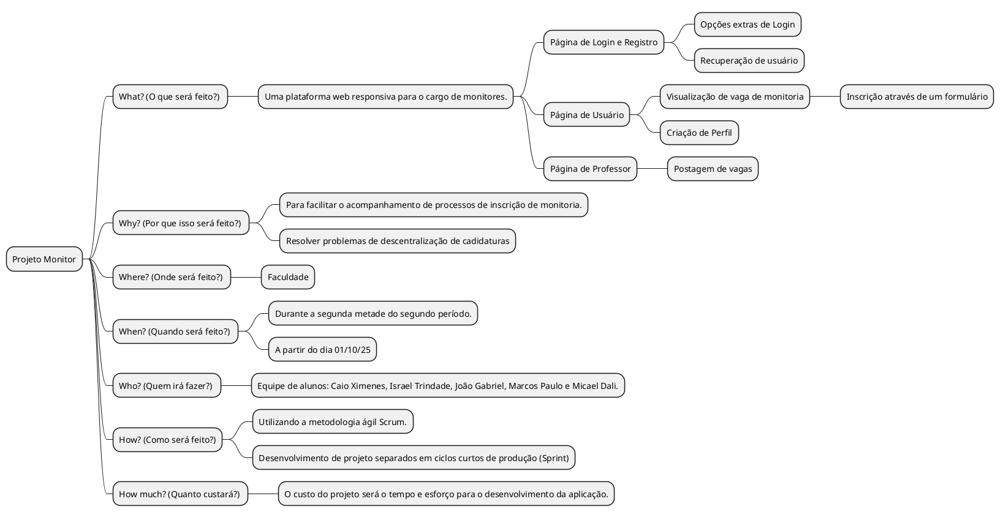

```puml
@startmindmap
+ Projeto Monitor
++ What? (O que será feito?) 
+++ Uma plataforma web responsiva para o cargo de monitores.
++++ Página de Login e Registro
+++++ Opções extras de Login
+++++ Recuperação de usuário
++++ Página de Usuário
+++++ Visualização de vaga de monitoria
++++++ Inscrição através de um formulário
+++++ Criação de Perfil
++++ Página de Professor
+++++ Postagem de vagas
++ Why? (Por que isso será feito?) 
+++ Para facilitar o acompanhamento de processos de inscrição de monitoria.
+++ Resolver problemas de descentralização de cadidaturas
++ Where? (Onde será feito?) 
+++ Faculdade
++ When? (Quando será feito?) 
+++ Durante a segunda metade do segundo período.
+++ A partir do dia 01/10/25
++ Who? (Quem irá fazer?) 
+++ Equipe de alunos: Caio Ximenes, Israel Trindade, João Gabriel, Marcos Paulo e Micael Dali.
++ How? (Como será feito?)
+++ Utilizando a metodologia ágil Scrum.
+++ Desenvolvimento de projeto separados em ciclos curtos de produção (Sprint)
++ How much? (Quanto custará?) 
+++ O custo do projeto será o tempo e esforço para o desenvolvimento da aplicação.
@endmindmap
```