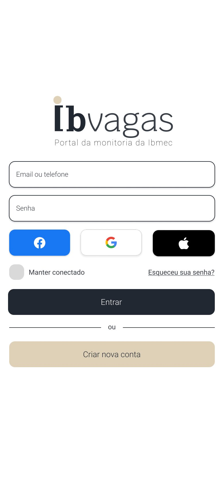
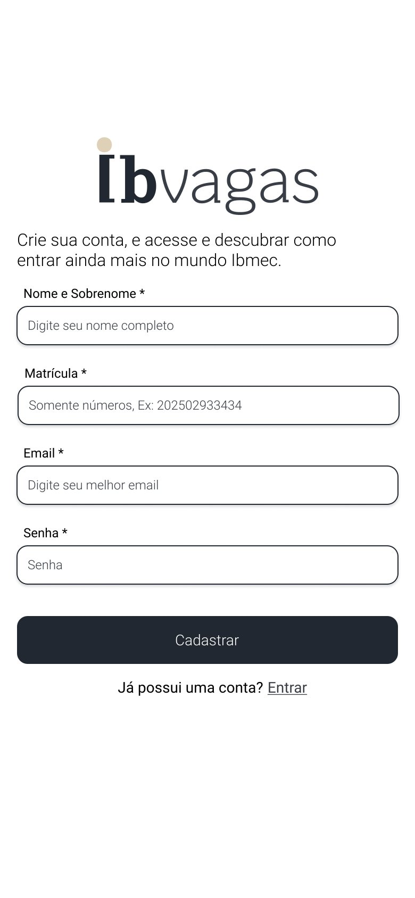
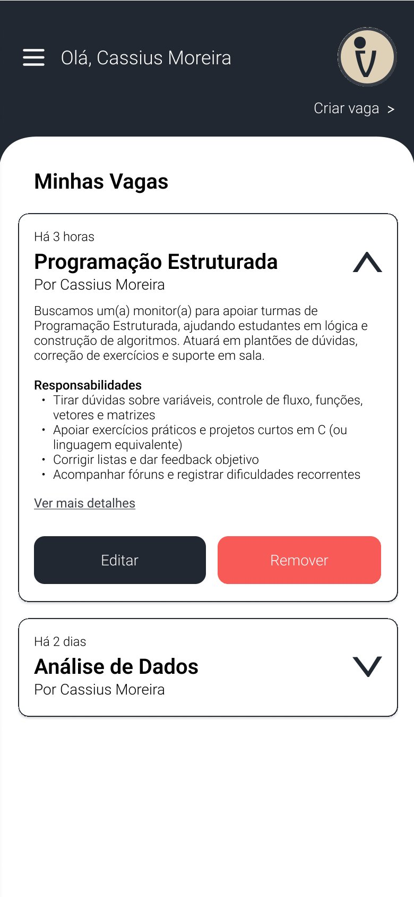
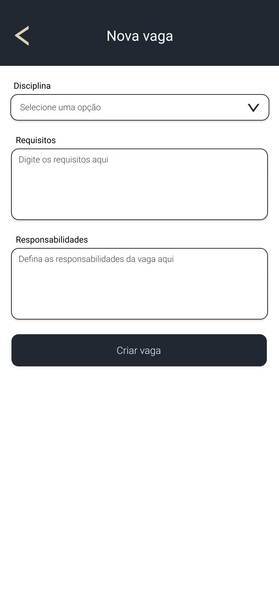
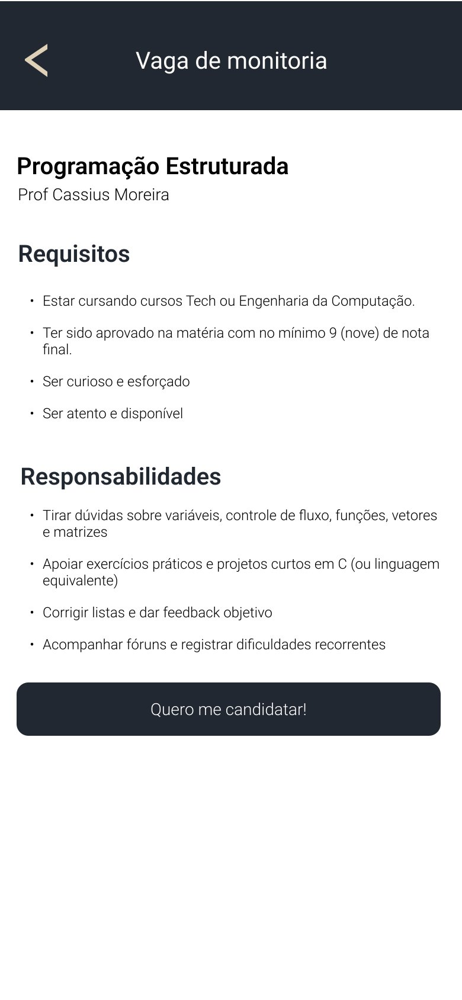
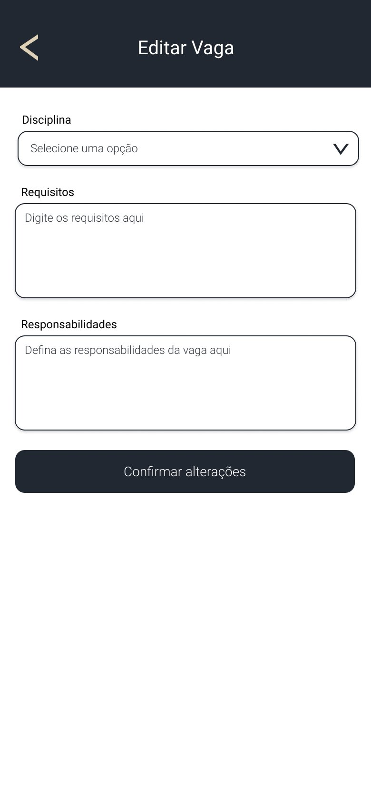
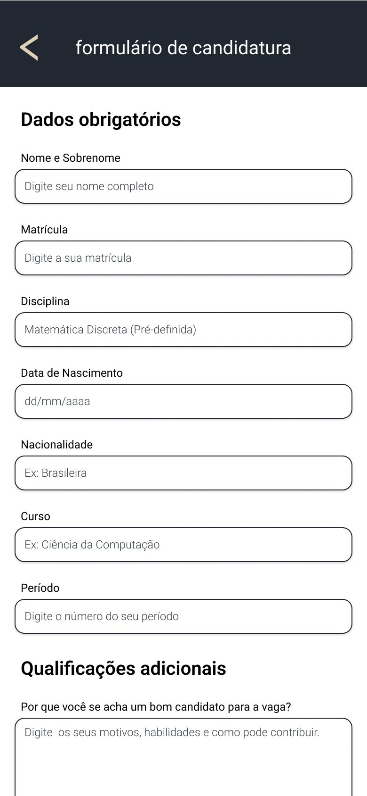
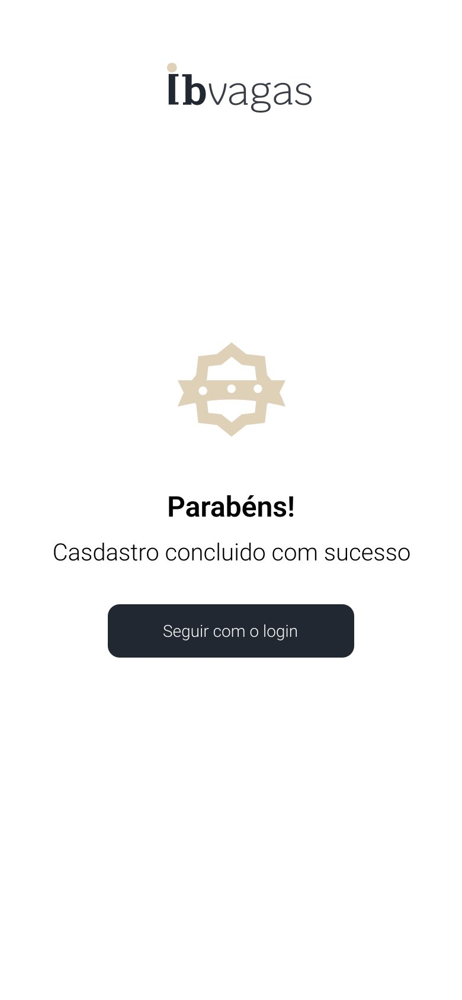

### Prototipação de Alta Fidelidade

Esta seção apresenta os protótipos de alta fidelidade do projeto **Ibvagas**, representando a interface da aplicação com design, cores, tipografia e layout definidos. Oferencendo uma visão clara da experiência do usuário e da identidade da plataforma.

> Para mais detalhes sobre as escolhas de design clique no link: <a href="https://docs.google.com/document/d/1a_oj0OoJXu7W2TgzwVDV6B78wUVgaFCS6OIAmC3BrUY/edit?usp=sharing" target="_blank" rel="noopener noreferrer">https://docs.google.com/document/d/1a_oj0OoJXu7W2TgzwVDV6B78wUVgaFCS6OIAmC3BrUY/edit?usp=sharing</a>

---

#### **1. Tela de Login**

Esta é a porta de entrada para a plataforma. O design prioriza a simplicidade e a eficiência, permitindo que os usuários façam login com suas credenciais ou por meio de provedores de autenticação social, como Facebook, Google e Apple.

* **Propósito**: Autenticar o usuário e direcioná-lo para a área correta (aluno, professor ou coordenador).
* **Elementos Chave**:
    * Campos de entrada para e-mail/telefone e senha.
    * Botões para login social, alinhando-se com a sugestão de "Login com Google" discutida no brainstorming.
    * Opção de "Criar nova conta" para usuários que ainda não têm um cadastro.

---

#### **2. Tela de Cadastro**

O formulário de cadastro foi projetado para ser intuitivo, solicitando apenas as informações essenciais para a criação de uma conta de aluno. O objetivo é reduzir o atrito e simplificar o processo de adesão à plataforma.

* **Propósito**: Permitir que novos alunos criem suas contas na plataforma.
* **Elementos Chave**:
    * Campos para Nome e Sobrenome, Matrícula, E-mail e Senha.
    * Chamada clara para ação: "Cadastrar".
    * Link para a página de login para usuários que já possuem uma conta.

---

#### **3. Redefinição de Senha**

Esta tela faz parte do fluxo de recuperação de acesso. O usuário pode solicitar um link de redefinição de senha, que será enviado para o e-mail cadastrado, garantindo a segurança de sua conta.

* **Propósito**: Oferecer um caminho seguro para a recuperação de senha.
* **Elementos Chave**:
    * Campo para inserir o e-mail do usuário.
    * Botão "Enviar link de recuperação".

---

#### **4. Feed de Vagas (Aluno)**

Esta é a página principal para o usuário aluno. Ela funciona como um feed, exibindo todas as vagas de monitoria abertas de forma clara e organizada. O design em cards facilita a visualização e a interação com cada oportunidade.

* **Propósito**: Apresentar de forma centralizada todas as vagas de monitoria disponíveis para o aluno.
* **Elementos Chave**:
    * Lista de cards expansíveis, cada um contendo o título da vaga, o nome do professor, uma breve descrição e os requisitos/responsabilidades.
    * Botão "Quero me candidatar!" em cada card, agilizando o processo de inscrição.
    * Opção de navegação para "Minhas candidaturas" no cabeçalho.

---

#### **5. Dashboard (Professor)**

Este é o painel de controle do professor. Diferente do feed do aluno, ele lista apenas as vagas criadas pelo próprio professor, oferecendo ferramentas para gerenciá-las.

* **Propósito**: Fornecer uma área para o professor gerenciar as vagas de monitoria que ele criou.
* **Elementos Chave**:
    * Botão "Criar vaga" no cabeçalho, seguindo o fluxo de criação de vagas.
    * Lista de cards, cada um representando uma vaga publicada.
    * Botões "Editar" e "Remover" em cada card, permitindo a gestão das vagas em tempo real.

---

#### **6. Tela de Criação de Vaga**

Esta tela é um formulário simples e direto, destinado ao professor que deseja publicar uma nova vaga de monitoria. O layout otimizado permite a rápida inserção das informações essenciais para a oportunidade.

* **Propósito**: Facilitar a criação e publicação de novas vagas de monitoria por parte dos professores.
* **Elementos Chave**:
    * Campos para selecionar a disciplina, preencher os requisitos e definir as responsabilidades da vaga.
    * Botão "Criar vaga" para finalizar e publicar a oportunidade.

---

#### **7. Tela de Detalhes da Vaga**

Ao clicar em uma vaga no feed, o usuário é direcionado para esta tela, que exibe todas as informações detalhadas da oportunidade, incluindo requisitos e responsabilidades de forma clara.

* **Propósito**: Oferecer uma visão completa de uma vaga de monitoria específica antes da candidatura.
* **Elementos Chave**:
    * Título da vaga, nome do professor.
    * Seções para "Requisitos" e "Responsabilidades" com listas de itens.
    * Botão de ação "Quero me candidatar!".

---

#### **8. Tela de Perfil do Usuário**

Esta página permite que o usuário gerencie suas informações pessoais. O layout foi pensado para a clareza, com campos editáveis e opções de segurança, como a alteração de senha.

* **Propósito**: Oferecer uma área para o usuário visualizar e editar suas informações de perfil.
* **Elementos Chave**:
    * Campos para Nome e Sobrenome, Senha, Celular e um campo para o nome social preferido ("Como você quer ser chamado?").
    * Botões de ação para "Confirmar alterações" e "Solicitar e-mail de alteração de senha".
    * Opção para "Sair" da conta.

---

#### **9. Tela de Edição de Vaga**

Esta tela fornece ao professor a flexibilidade de atualizar uma vaga já publicada. O design segue a simplicidade da tela de criação, permitindo que alterações nos requisitos e responsabilidades sejam feitas de forma rápida e intuitiva, garantindo que as informações para os candidatos estejam sempre corretas.

* **Propósito**: Permitir que professores modifiquem os detalhes de uma vaga de monitoria existente sem a necessidade de recriá-la.
* **Elementos Chave**:
    * Seleção da disciplina (provavelmente não editável após a criação).
    * Campos de texto para alterar os **Requisitos** e **Responsabilidades**.
    * Botão de ação claro para **"Confirmar alterações"**.

---

#### **10. Formulário de Candidatura do Aluno**

Este é um dos passos mais importantes no fluxo do aluno. Após encontrar uma vaga de interesse e clicar em "Quero me candidatar!", ele é direcionado para este formulário. O layout foi estruturado para diferenciar claramente os **dados obrigatórios**, exigidos pela instituição, das **qualificações adicionais**, que servem como um diferencial para a análise do professor.

* **Propósito**: Coletar de forma organizada todas as informações necessárias para que o aluno possa submeter sua candidatura a uma vaga.
* **Elementos Chave**:
    * **Dados Obrigatórios**: Campos como Nome, Matrícula, Disciplina (pré-definida pela vaga), Data de Nascimento, Nacionalidade, Curso e Período.
    * **Qualificações Adicionais**: Um campo de texto aberto para que o candidato possa descrever suas motivações e habilidades, conforme idealizado na sessão de brainstorming.
    * Design limpo e com espaçamento adequado para facilitar o preenchimento em dispositivos móveis.

---

#### **11. Tela de Confirmação de Cadastro**

Para garantir uma boa experiência ao novo usuário, esta tela fornece um feedback visual imediato após a conclusão bem-sucedida do cadastro. O design é minimalista, focado em comunicar o sucesso da operação e guiar o usuário para o próximo passo lógico.

* **Propósito**: Confirmar ao usuário que sua conta foi criada com sucesso e direcioná-lo para o fluxo de login.
* **Elementos Chave**:
    * Mensagem de confirmação clara e positiva: "Parabéns! Cadastro concluído com sucesso".
    * Identidade visual da plataforma ("Ibvagas") presente.
    * Um único botão de chamada para ação ("Seguir com o login") para evitar qualquer dúvida sobre o que fazer a seguir.

